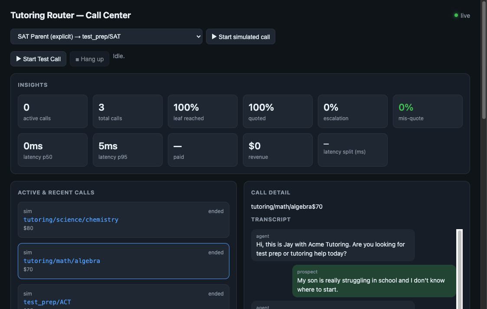
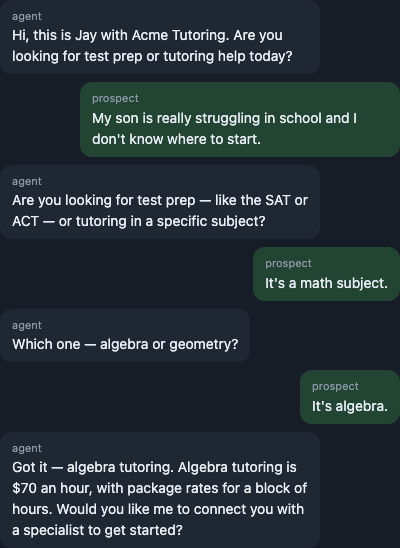
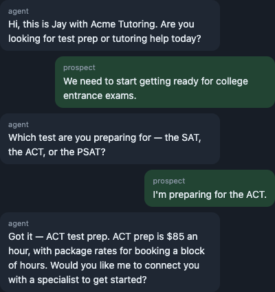

# Voice Intent-Router Agent

A real-time voice AI agent for a tutoring sales company. It converses naturally to
figure out which of two things the caller needs — **test prep** (SAT / ACT / PSAT) or **tutoring**
(math: algebra, geometry; science: chemistry, biology, physics) — drills down to the specific
test/subject, **quotes that program's price**, and answers informational questions from a grounded
knowledge base. Every call captures a transcript, a per-turn decision trace, and KPIs, and a
synthetic-persona benchmark grades the agent on **classification accuracy**.

The brand used throughout ("Acme Tutoring") is a fictional placeholder — set `company_name` in
`backend/config.toml`.



Deeper dive: [`docs/recursive-improvement-summary.md`](docs/recursive-improvement-summary.md) —
the variant → controlled experiment → promote/retire loop, run twice (both honest negative results).

## Key features

- Confidence scoring to handle ambiguous answers
- Conversational context across turns
- Slot-filling decision tree over the product taxonomy
- Knowledge-base retrieval (RAG) with an honest fallback
- Deterministic product pricing lookup
- Payment links by text message (Stripe hosted checkout + Twilio SMS)

| Ambiguous caller → algebra tutoring | Ambiguous caller → ACT prep |
| --- | --- |
|  |  |

Screenshots are simulated calls on the offline rule brain (no API keys).

## What it does
- **Live voice** (browser/WebRTC): Deepgram STT → LLM brain → Cartesia TTS, with VAD turn-taking.
- **LLM-driven core:** an OpenAI tool-calling brain owns each turn — it slot-fills the taxonomy
  from what the caller says, asks the next disambiguating question when unsure, answers from the
  KB, and quotes a price once it knows the exact leaf. An offline rule-based brain drives tests and
  self-play with no API key. The same engine runs live calls and synthetic self-play.
- **Deterministic pricing:** the price is an **exact table lookup keyed by the classification
  leaf** — never retrieved or invented. A mis-quote guardrail blocks any off-table number.
- **Grounded answers:** semantic retrieval (OpenAI embeddings) over approved KB docs with source
  IDs; honest fallback when content is insufficient.
- **Guardrails:** never states an off-table price/guarantee, never claims to be human, escalates
  high-risk asks (discounts, payments, complaints, explicit human requests).
- **Observability:** every call persists transcript, per-turn decision trace (action, reason,
  confidence, slot state, reached leaf), KPI events, and the quoted price; a dashboard reads the API.
- **Improvement loop:** run brain variants against ground-truth personas; promote one only if it
  raises Classification Accuracy without regressing the guardrail rates (human-approved).

## Architecture at a glance

- **Backend:** Python + FastAPI, SQLAlchemy ORM, SQLite (single file). `pytest` + `ruff`.
- **Brain:** OpenAI tool-calling (`slot_fill` / `kb_lookup` / `quote_price` / `escalate`); offline
  `RuleBrain` fallback.
- **Voice:** Pipecat pipeline (Deepgram / Cartesia) over WebRTC; optional `voice` extra.
- **Knowledge base:** markdown chunker + OpenAI-embedding vector retriever stored in SQLite
  (Python cosine in dev; sqlite-vec is the production swap — see `docs/decision-log.md` D-17);
  TF-IDF fallback offline.
- **Benchmark:** ground-truth personas drive the real engine in text mode; scored on
  classification accuracy, turns-to-classification, and mis-quote/escalation rates.
- **Dashboard:** UI at `/dashboard` reading the backend API.

```
ai-sales-agent/
├── backend/app/
│   ├── voice/        # Pipecat pipeline + bot (live voice path)
│   ├── agent/        # taxonomy, brain, intent_engine, contract, pricing, guardrails, knowledge
│   ├── kb/           # ingest, embeddings, vector_retriever, TF-IDF retriever
│   ├── memory/       # lead store + cross-call memory
│   ├── simulator/    # personas, benchmark (accuracy), improvement loop
│   ├── kpis/         # event vocab + metric computation
│   ├── dashboard/    # API router
│   └── db/           # models, session, seed
├── data/             # leads, kb (placeholder), personas, pricing (placeholder), audio
├── frontend/         # demo + dashboard clients
└── docs/             # requirements, build plan, decision log, runbook, notes
```

## Quick start

Full instructions are in **`docs/RUNBOOK.md`**. Short version, from the repo root:

```bash
cd backend
python3.12 -m venv .venv
.venv/bin/python -m pip install -r requirements/dev.txt   # pinned core + dev tools
.venv/bin/python -m pip install --no-deps -e .
.venv/bin/python -m app.db.seed               # create schema + seed sample leads
.venv/bin/python -m app.kb.index              # build the KB vector index (needs OPENAI_API_KEY)
.venv/bin/uvicorn app.main:app --reload --port 8000
```

Verify: `curl -s http://localhost:8000/health` and open http://localhost:8000/dashboard.

Locally (`ENVIRONMENT=development`, the default) the dashboard is open. Anywhere else, set
`DASHBOARD_PASSWORD` (HTTP Basic, user `operator`) or operator routes return 503 — see
`docs/RUNBOOK.md` §4.

The brain uses OpenAI when `OPENAI_API_KEY` is set (in `backend/.env`); without it, the offline
rule-based brain runs so the app and tests work with no key. The KB index
(`python -m app.kb.index`) embeds the approved docs for semantic lookup — rerun it after editing
`data/kb/*.md` or recreating the DB; without an OpenAI key, KB retrieval falls back to TF-IDF.

### Voice demo (needs API keys)

```bash
.venv/bin/python -m pip install -r requirements/dev-voice.txt   # pinned, incl. the voice extra
# add OPENAI_API_KEY, DEEPGRAM_API_KEY, CARTESIA_API_KEY to backend/.env
.venv/bin/uvicorn app.main:app --reload --port 8000
```

Open http://localhost:8000/demo, click **Call**, allow the mic, and talk — the agent greets first.
A browser + microphone are required; the voice path can't be exercised headlessly.

### Run the accuracy benchmark / improvement loop

The benchmark runs the router personas through the real engine and scores classification accuracy.
Offline (rule brain) it's a wiring/metric check; point it at OpenAI for a meaningful score. See
`app/simulator/benchmark.py` (`run_benchmark`) and `app/simulator/improvement.py` (`run_improvement`).

## Validation

```bash
cd backend
.venv/bin/ruff check .          # lint
.venv/bin/ruff format --check . # formatting
.venv/bin/python -m pytest -q   # tests
```

## Documentation

| Doc | What it covers |
| --- | --- |
| `docs/brainstorms/intent-router-agent-requirements.md` | Requirements (current source of truth) |
| `docs/BUILD_PLAN_INTENT_ROUTER.md` | Phased build plan, ticket status |
| `docs/decision-log.md` | Major product/technical decisions and tradeoffs |
| `docs/limitations.md` | What was/wasn't tested; production requirements |
| `docs/RUNBOOK.md` | Detailed setup, voice extra, troubleshooting |
| `docs/implementation-notes.md` | Running, ticket-level decision/deviation log |
| `docs/PRD.md`, `docs/BUILD_PLAN.md` | Original discovery-to-close scope (superseded) |
