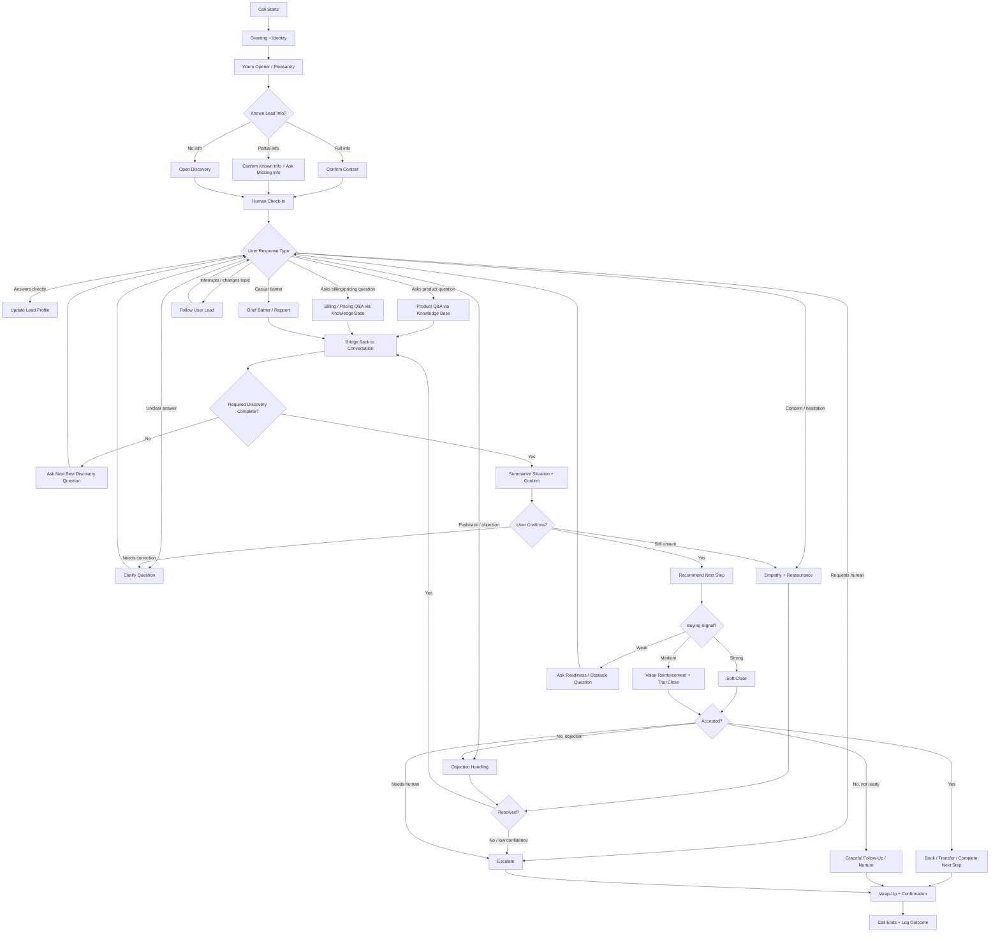

# Agent Conversation Flow (Mockup)

> **Status:** Discussion mockup, not yet implemented. This document captures the
> intended conversation behavior for the voice sales agent so we can align on it
> before building the orchestrator (BUILD_PLAN P2-T3) and decisioning layer
> (P3-T3). It expands on the conversation stages in `PRD.md` §17 and the
> next-action set in `PRD.md` §9.5 (DE-1).

## 1. Core Idea

The sales agent needs to know **where it is in the call**, but it also needs
permission to do normal human things: greet, acknowledge, clarify, reassure,
make small talk, buy time, answer side questions, and then **gently return to
the sales path**.

The agent has two simultaneous jobs:

### Layer 1 — Sales Progression (the structured path)

```
Greeting → Context → Discovery → Need Development → Q&A
        → Objection Handling → Fit Summary → Close → Wrap-Up
```

### Layer 2 — Human Conversation (what makes it sound real)

```
Pleasantries → Acknowledgment → Clarification → Empathy
        → Reassurance → Banter → Time Fillers → Topic Recovery
```

The voice model should **not** sound like:

> "Question 1. What subject do you need help with? Question 2. What grade is the
> student in?"

It should sound more like:

> "Got it — math support for your daughter. And just so I understand the
> situation, is this more about staying caught up day to day, or is there a
> specific test or class she's worried about right now?"

## 2. Flow Map



## 3. The Flow Is Not Linear

A realistic sales call has loops:

- Discovery → Q&A → Discovery
- Discovery → Empathy → Clarification → Discovery
- Discovery → Objection → Reassurance → Product Explanation → Close
- Close → Objection → Clarify → Reframe → Close Again

So the agent should be driven by **states and transitions, not a fixed script.**

## 4. Stages and Modifiers

**Decision (resolved):** `PRD.md` §17's 11 stages stay the canonical, logged
`stage` enum (the `Decision.stage` column in `backend/app/db/models.py`). The
extra human-layer states from the mockup are **modifiers**, not stages — they
describe the conversational *move* the agent makes on a given turn without
advancing the sales arc. The active `stage` persists across modifier turns.

This keeps the decision trace clean (11 stable values to chart KPIs against)
while still letting the agent be human.

### 4.1 Logged stages (the `stage` enum — 11 values)

| Stage                  | Purpose                                          |
| ---------------------- | ------------------------------------------------ |
| `greeting`             | Start call and identify user                     |
| `context_confirmation` | Confirm known lead data                          |
| `discovery`            | Collect missing required fields                  |
| `need_development`     | Explore pain, urgency, motivation                |
| `knowledge_answer`     | Answer product / pricing / policy questions (KB) |
| `objection_handling`   | Handle sales resistance                          |
| `fit_summary`          | Summarize need and confirm understanding         |
| `close`                | Ask for next-step commitment                     |
| `escalation`           | Transfer or flag for human                       |
| `wrap_up`              | Confirm next step and end call                   |
| `disqualified`         | Lead is not a fit; stop selling                  |

### 4.2 The two fields, decided

**Decision (resolved):** the trace carries two independent dimensions per turn.

- **`selected_action`** always carries the **sales action** — exactly one of
  `PRD.md` §9.5 (DE-1)'s 10 next-actions. This is the sales-progression intent
  and is always present on a decision turn.
- **`modifier`** is a **separate, optional field** for the human-layer move. It
  is populated only during **ambiguous or non-progressing moments** (the user is
  unclear, emotional, off-topic, or the agent needs to cover latency). On a clean
  progression turn it stays empty. It does **not** change the active `stage`.

So the trace reads as: *where the call is* (`stage`) × *the sales intent being
served* (`selected_action`) × *the human move wrapping it, if any* (`modifier`).

> **Schema impact:** `Decision` has no `modifier` column today
> (`backend/app/db/models.py:125`). This is a proposed nullable `String` field —
> not yet implemented.

### 4.3 The `selected_action` vocabulary (PRD §9.5 DE-1 — 10 values)

| `selected_action`        | DE-1 action                     |
| ------------------------ | ------------------------------- |
| `ask_required_discovery` | Ask required discovery question |
| `ask_leading_discovery`  | Ask leading discovery question  |
| `answer_knowledge`       | Answer knowledge question       |
| `handle_objection`       | Handle objection                |
| `summarize_fit`          | Summarize fit                   |
| `pivot_toward_close`     | Pivot toward close              |
| `attempt_close`          | Attempt close                   |
| `escalate`               | Escalate to human               |
| `disqualify`             | Disqualify lead                 |
| `end_call`               | End call                        |

### 4.4 The `modifier` vocabulary (optional, ambiguity-time only)

| `modifier`    | Purpose                                              |
| ------------- | ---------------------------------------------------- |
| `rapport`     | Brief pleasantry or warm opener                      |
| `clarify`     | Resolve an ambiguous user answer                     |
| `reassure`    | Respond to concern or frustration with empathy       |
| `banter`      | Brief casual response, then return                   |
| `bridge_back` | Return from a side topic to the sales flow           |
| `time_filler` | Cover retrieval / reasoning latency purposefully     |

### 4.5 How a mockup state maps to what gets logged

| Mockup state (§2 / §5)      | `stage`                | `selected_action`        | `modifier`    |
| --------------------------- | ---------------------- | ------------------------ | ------------- |
| Warm Opener / Pleasantry    | `greeting`             | `ask_required_discovery` | `rapport`     |
| Confirm Context             | `context_confirmation` | `ask_required_discovery` | —             |
| Ask Next Best Discovery     | `discovery`            | `ask_required_discovery` | —             |
| Explore pain / urgency      | `need_development`     | `ask_leading_discovery`  | —             |
| Clarify an unclear answer   | `discovery` (unchanged)| `ask_required_discovery` | `clarify`     |
| Product Q&A                 | `knowledge_answer`     | `answer_knowledge`       | —             |
| Billing / Pricing Q&A       | `knowledge_answer`     | `answer_knowledge`       | —             |
| Empathy + Reassurance       | *(stage unchanged)*    | `handle_objection`       | `reassure`    |
| Objection Handling          | `objection_handling`   | `handle_objection`       | —             |
| Brief Banter                | *(stage unchanged)*    | *(intent being steered)* | `banter`      |
| Bridge Back                 | *(stage unchanged)*    | *(intent being steered)* | `bridge_back` |
| Summarize Situation         | `fit_summary`          | `summarize_fit`          | —             |
| Soft / Trial / Direct Close | `close`                | `attempt_close`          | —             |
| Escalate                    | `escalation`           | `escalate`               | —             |
| Wrap-Up + Confirmation      | `wrap_up`              | `end_call`               | —             |

> **One gap to settle:** DE-1's 10 actions are sales-progression-only — there is
> no "greet" or "confirm context" action. The `greeting` opener happens before any
> user turn, so it produces no decision row (DE-1 is "after each user turn"), which
> is fine. But `context_confirmation` *does* follow a user turn, so it currently
> has to borrow `ask_required_discovery`. Decide later whether to add a
> `confirm_context` action to DE-1 or keep folding it in. Tracked in §7 #1.

## 5. Stage-by-Stage Behavior

### 5.1 Greeting

Establish identity, tone, and reason for call. Keep it short — do not over-explain.

- "Hi, this is Ava with Varsity Tutors. Am I speaking with Sarah?"
- "Hey Sarah, thanks for taking the call. I'm reaching out about the tutoring request you submitted."

### 5.2 Permission / Soft Framing

Make the call feel respectful so it doesn't sound like a launched pitch.

- "Do you have a couple minutes to talk through what you're looking for?"
- "I'll just ask a few quick questions so I can point you in the right direction."

### 5.3 Pleasantry / Light Rapport

Sound human without wasting time. Optional and brief — too much banter from an AI feels fake.

- "How's your day going so far?"
- "No worries at all — I know schedules get busy."
- "Totally understand. School stuff can pile up quickly."

### 5.4 Context Confirmation

Use prior info when it exists.

- **Full info:** "I see you were looking for help with 8th grade algebra. Is that still the main thing you're trying to solve?"
- **Partial info:** "I have that this is for math help, but I don't yet know the grade level or what's been hardest lately."
- **No info:** "Can you tell me a little bit about who the tutoring would be for?"

### 5.5 Discovery

Learn the sales-relevant details. **Adapt — do not run a checklist.**

Core discovery questions:

- Who needs help?
- What subject or test?
- What grade or level?
- What prompted you to look now?
- What would success look like?
- How soon are you hoping to start?
- Have you tried tutoring before?
- What kind of schedule would work?
- Are you the person deciding whether to move forward?

- **Bad:** "What is the subject? What is the grade? What is your timeline?"
- **Better:** "Got it. And what made you start looking now — was there a recent test, a grade concern, or more of a confidence issue?"

### 5.6 Clarifying Questions

A dedicated clarification state makes the agent sound attentive instead of scripted.

- "When you say she's struggling, do you mean the homework is hard, test scores are dropping, or she's losing confidence?"
- "Just to make sure I understand — are you looking for ongoing weekly support, or help with something urgent coming up?"
- "When you say flexible, are evenings usually better, or weekends?"

### 5.7 Product Q&A

The user may ask questions at any time (how it works, tutor selection, online vs in person, changing tutors, subjects covered).

Flow: **User asks → retrieve grounded answer → answer briefly → check if it helped → bridge back.**

> "Great question. Varsity Tutors matches students with tutors based on the
> subject, goals, schedule, and learning needs... Does that sound like the kind
> of support you were hoping for?"

Then bridge:

> "Helpful. And for your daughter specifically, is the bigger issue understanding
> the material, or staying motivated to practice?"

### 5.8 Billing / Pricing Q&A

High-stakes — must be grounded. **Acknowledge → give approved answer → avoid unsupported specifics → offer next step / escalation.**

> "I can definitely help with that. Pricing can depend on the type of support and
> plan, so I don't want to give you the wrong number. What I can do is understand
> what you need first, then help get you to the right option."

If specific pricing is unavailable:

> "I don't want to guess on pricing. I can connect you with a specialist who can
> confirm the exact options."

### 5.9 Empathy and Reassurance

One of the most important layers for a voice sales agent. Emotional moments:
"My child is falling behind," "We tried tutoring and it didn't work," "She hates
math," "I'm worried we waited too long," "I don't know what she needs."

Shape: **Acknowledge emotion → normalize → reassure → ask a useful next question.**

> "I completely understand. A lot of parents reach out when it feels like things
> are starting to snowball. The good news is that once we understand where she's
> getting stuck, support can be much more targeted. Has this been building for a
> while, or did something specific happen recently?"

### 5.10 Casual Time Fillers

Useful when the agent needs time for retrieval, reasoning, or tool calls. Silence
feels broken — but filler must be purposeful, not random.

- **Good:** "Sure — the important distinction is this…" / "Good question — let me separate that into two parts."
- **Bad:** "Um, yeah, totally, like, you know…"

### 5.11 Objection Handling

Common objections: too expensive, need to talk to spouse, just looking, may use a
local tutor, tried this before, don't want to commit.

Flow: **Acknowledge → validate → clarify → reframe → ask next-step question.**
Don't immediately rebut — explore.

> "I hear you. Cost matters, especially when you're not yet sure what level of
> support your child needs. Can I ask — are you mainly trying to keep the cost
> low, or are you trying to make sure that if you do invest, it actually works?"

### 5.12 Fit Summary

Summarize before closing. Shows listening, creates trust, sets up the close.

> "Let me make sure I have this right. Your son is in 10th grade geometry, his
> test scores have dropped over the last month, and you're hoping to get him back
> on track before finals... Is that accurate?"

### 5.13 Close

Match the close to the user's readiness.

- **Soft Close:** "Based on what you shared, I do think tutoring could be a good fit. The next step would be to look at tutor options and scheduling. Would you like to do that?"
- **Trial Close:** "Would it be helpful if I walked you through what getting matched would look like?"
- **Direct Close:** "Would you like to get started with a tutor this week?"
- **Escalation Close:** "This sounds like a good fit, but I want to make sure you get accurate pricing and plan details. I can connect you with someone who can finalize that with you."

## 6. Key Design Principle

The agent should not ask:

> "What question should I ask next?"

It should ask:

> "What does this moment in the conversation require?"

Sometimes the answer is a discovery question. Sometimes it is reassurance.
Sometimes it is a product answer. Sometimes it is silence avoidance. Sometimes it
is clarification. Sometimes it is a close. That is what makes the agent sound
human in substance and flow.

## 7. Open Questions (for discussion)

1. ~~**State reconciliation** — adopt the 16-state list, or map it back onto the
   PRD's 11 stages?~~ **Resolved:** keep PRD's 11 stages as the logged `stage`
   enum (§4.1); `selected_action` carries the sales action (DE-1's 10 values,
   §4.3); human-layer moves live in a separate optional `modifier` field used only
   during ambiguous moments (§4.4). *Remaining sub-question:* add a
   `confirm_context` action to DE-1, or keep folding context confirmation into
   `ask_required_discovery`? (See §4.5 gap note.)
2. **Who picks the state?** — single LLM with a structured prompt that emits the
   chosen state + utterance, vs. a separate decisioning call before generation.
3. **Latency budget** — Q&A and billing require KB retrieval; how do time fillers
   cover that gap without sounding canned?
4. **Loop guards** — what prevents clarification ↔ user-response loops, or repeated
   failed closes, from running forever before escalation?
5. **Decision logging** — how do these states/transitions map onto the existing
   `Decision` model fields (`stage`, `selected_action`, `reason`, `confidence`)?
