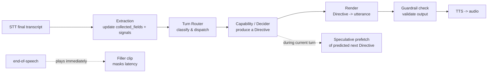

# Agent Integration & Latency — Design

> **Status:** Approved design, not yet built. Defines how the structured agent layer
> (Phases 2–4) becomes what the live agent actually *says*, and the latency strategy that
> keeps it fast. Implemented by **Phase 4.5** in `BUILD_PLAN.md`. Builds on the conversation
> model in `AGENT_FLOW.md`.

## 1. The problem we're solving

Today there are **two disconnected "brains"** (see the design discussion that produced this doc):

- **Live path (what actually runs):** `run_bot` → Pipecat → Deepgram STT → Claude → Cartesia
  TTS. Claude is given only the persona prompt (`build_system_prompt`) + a greeting cue and
  **decides every word freeform**. It is never told the stage, the missing field, the KB
  content, whether the caller objected, or when to escalate.
- **Structured layer (built, but switched off):** orchestrator, `DiscoveryDecider`, discovery
  playbook, KB retriever + grounded answers, objection handling, closing, guardrails. These
  produce a `NextAction`, but **nothing in the live path invokes them** — they're exercised
  only by tests.

So everything that makes this a *measurable, grounded, guardrailed* sales agent — decision
traces, KB-grounding guarantees, the Phase 7 experiment loop — currently has **zero influence
on what the agent says.** Phase 4.5 connects the two.

## 2. Chosen architecture: Decider-led, LLM-renders

Each turn, the **structured layer decides *what* to do and *what content* to convey**; the
**LLM only phrases that one thing naturally** (DF-4); **guardrails validate** the result. This
is the only option that puts the structured layer in the path, which the PRD's whole thesis
(observability, grounding, experiments) requires. (Alternatives considered: LLM-led/tools-assisted,
and hybrid-validate — rejected as primary because they weaken the decision trace and grounding
guarantees.)

### Per-turn flow

## 3. Components (the Phase 4.5 build)

| Component | Responsibility | New file |
| --- | --- | --- |
| **Turn router** | Per-turn classify + priority dispatch: escalation (DE-4) → refusal/disqualify → objection → knowledge question → discovery/close. Deterministic. | `app/agent/router.py` |
| **Extraction** | Turn the caller's utterance into `collected_fields` updates + signals (answer to pending question, `buying_intent`). The missing NLU. Starts rule-based, moves to LLM structured extraction. | `app/agent/extraction.py` |
| **Decider / capabilities** | Already built (P3–P4): `DiscoveryDecider`, `answer_knowledge`, `handle_objection`, `check_escalation`, closing. The router calls these. | _(exists)_ |
| **Directive + render** | Standardize the overloaded `NextAction.prompt` into a structured **Directive**, and a single pure `render(directive, state) → utterance`. | `app/agent/render.py` |
| **Conversation engine** | Transport-agnostic `run_turn` loop tying router → extraction → capability → render → recorder + decision trace. Used by **both** the simulator (Phase 6) and the live voice pipeline. | `app/agent/engine.py` |
| **Live wiring** | Replace the raw-Claude path in `run_bot` with the engine; persist turns/decisions; enforce `check_agent_output`. | `app/voice/*` |
| **Latency tiers** | Pre-synthesized static/filler audio, cached FAQ answers, filler-masking, speculative prefetch. | `app/voice/latency.py` |

## 4. The Directive contract (fixing the overloaded `prompt`)

Today `NextAction.prompt` is inconsistent — sometimes literal words to say (rebuttal, fit
summary, escalation line, KB-4 fallback), sometimes an instruction to the LLM
(`grounding_prompt`: "answer using ONLY this…"). Phase 4.5 replaces it with a **Directive**:

- `intent` — the dialogue act (ask question, confirm, answer-from-KB, rebut, summarize fit,
  attempt close, escalate, …) — derived from the existing `Action`/`Stage`.
- `content` — the material: a question's text, a rebuttal, retrieved KB snippets, the fields to
  weave into a confirmation/summary.
- `style` — modifiers (`rapport`, `reassure`, `time_filler`, …) from `AGENT_FLOW.md` §4.4.

**`render(directive, state) → utterance` is a pure function** (same directive in → same words
out). This is the linchpin: it both fixes the inconsistency *and* makes the next utterance
**cacheable / pre-computable** — which is what the latency strategy depends on.

## 5. Latency strategy

The decision step is deterministic Python (microseconds); the real cost is **LLM
time-to-first-token + TTS time-to-first-byte**. VC-3 targets: first response < 2s, barge-in
stop < 1s, KB-grounded answer < 4s. Two complementary ideas, both leaning on the fact that a
decider-led agent's next turn is *predictable* and its content is *largely pre-authored*:

### Eliminate compute — caching & speculation

- **Tier 0 — pre-synthesize static audio at startup.** Rebuttals, escalation handoff, KB-4
  fallback, greeting, and **filler clips** are fixed strings → synthesize once, cache the
  bytes, play instantly. No LLM/TTS in the hot path. Zero correctness risk, biggest win.
- **Tier 1 — cache grounded FAQ answers.** Pricing/scheduling/matching answers are stable →
  render once, serve from cache.
- **Tier 2 — speculative prefetch.** While the agent is *speaking* turn N (free compute) and
  while the user answers, asynchronously render the **predicted** next directive (almost always
  "ask the next missing required field," whose content the playbook already knows).

  **Correctness model:** speculation is a cache keyed by the **predicted next-action
  signature** (e.g. `ask_required_discovery:urgency`). The real turn's decider is always the
  source of truth — use the cached response **only if its signature matches**; mismatch =
  cache miss = render live. So a stale/wrong line can never be spoken; worst case is no speedup
  that turn. Hit rate is high because the happy path dominates a structured flow.

  *Tradeoffs:* discarded LLM/TTS calls on misses (speculate top 1–2 branches, not all);
  barge-in invalidates in-flight speculation (discard it).

### Mask compute — filler words/phrases

On end-of-speech, play a short **pre-synthesized** filler immediately while the real response
renders in parallel; the real audio plays right after the filler ends. Perceived latency ≈ the
filler's start time (~200ms).

- **Match the filler to the wait** (the router classifies in microseconds):
  - fast path → short neutral ack: "Sure—", "Got it,", "Okay,"
  - slow path (KB retrieval, escalation) → working/stall: "Good question — let me check on that…"
  - objection → empathy ack: "I hear you—"
- **Rules:** only fire long "let me look that up" fillers on genuinely slow paths; keep
  speculative fillers **neutral** so they can never contradict the response (never a committal
  "Absolutely, yes!" before the real reply might escalate or decline).
- **Pitfalls:** fillers must be **interruptible** (barge-in); the real response enqueues
  *after* the filler (no overlap); don't filler every turn (race: only filler if the response
  isn't ready within ~300–400ms, or restrict to known-slow paths); rotate clips so it doesn't
  loop.
- **Semantics:** a filler is a **cosmetic audio prefix**, not a decision. It does not change
  the `stage` or `selected_action`; it's logged (if at all) as `modifier = time_filler`. This
  is exactly why `time_filler` is a *modifier*, not an action (`AGENT_FLOW.md` §4.4 / §5.10).

### How they compose

Speculation/caching *eliminates* compute for predicted branches (often → no filler needed);
fillers *mask* the compute you couldn't eliminate (cache misses, the <4s grounded-answer case).
Best UX = both, plus Tier-0 static audio as the always-available floor.

### Design constraint that keeps it all possible

Keep the **decider deterministic** and **`render` a pure function of `(directive, state)`**. If
the LLM free-associates, speculation and caching break.

## 6. Sequencing (don't pre-optimize)

1. Build the **engine** (router + extraction + render) and prove a full
   discovery→KB→objection→close→escalation conversation runs end-to-end in **text mode**.
2. **Wire it into the live voice pipeline** (replace raw Claude).
3. **Measure** real latency vs VC-3.
4. Add **Tier 0** (free, no risk) — likely gets most of the way.
5. Add **filler-masking**, then **Tier 2 speculation**, only if measurement says so.

Design the path now so the latency tiers slot in later (pure `render`, deterministic decider,
action-signature cache key) — that costs nothing today.

## 7. Open questions / risks

- **Extraction reliability** is the hardest piece: misreading a caller's answer corrupts
  `collected_fields` and the whole flow. Needs confidence handling + a "didn't catch that →
  clarify" path (ties to the `clarify` modifier).
- **Buying-intent detection** is still unbuilt (objection detection exists, cue-based); the
  close gate needs it.
- **Naturalness vs control:** rendering one directive per turn risks stilted flow — mitigated by
  good `render` prompting + the persona, and by letting `render` weave prior context.
- **Speculation cost** (discarded calls) vs latency — measure before enabling.
- **Output-guardrail reconciliation:** `check_agent_output`'s blanket price-flag must be
  demoted/scoped once approved prices exist (see implementation-notes); enforce it on rendered
  output here.
